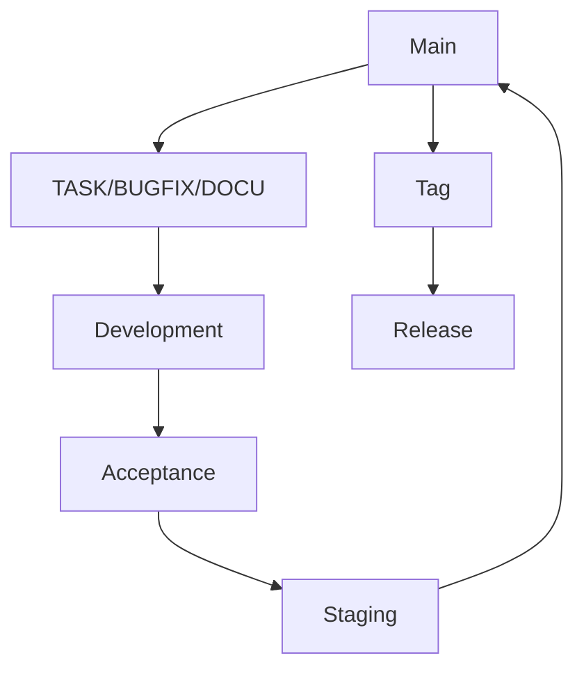

# Contribute

Thank you for your interest in contributing to this project. This is a personal project that I work on in my free time. While I plan to make regular progress, the focus is more on enjoying the process rather than rapid development.

There’s a lot of work ahead, from developing gameplay mechanics to building systems from scratch. I have a vision for where the project is headed, but I'm definitely open to other people's ideas and creativity. Ultimately, where this project ends up will be decided by what’s the most fun. That said, it’s important to keep the overall vision in mind as we move forward. You can find the detailed project vision in the [vision.md](meta/vision.md) file located in the `meta` directory.

I appreciate any contributions, whether it's code, ideas, or feedback. Good communication will be key as we work together, especially as the project evolves. If you have questions or ideas, feel free to reach out via [Discord](https://discord.gg/dzFgPC4U) or email (you can find the email by running `git log --reverse --format="%an <%ae>" | head -n 1` in this repo).

When contributing code, please follow standard practices like PEP 8, use strict typing, and include proper logging where applicable. It’s important that significant functionality is unit-tested. While not everything needs coverage, particularly complex areas involving the graphics engine, core features should have tests to ensure stability. If you get stuck or need guidance, don’t hesitate to ask for help—collaboration is key to moving the project forward. I welcome everyone’s unique skills and backgrounds, but please be aware that prior experience in your applicable skills is expected.

Beyond coding, skills in graphic design, sound, modeling, UI, and other creative areas are also valuable to the project. Any contribution, whether technical or creative, is welcome and appreciated. Everyone’s work, ideas, and vision will be respected, and any form of discrimination or disrespect will not be tolerated—we’re here to create something fun together.

If you’d like to contribute, fork the repository, make your changes, and submit a pull request with a brief description of your work. I’ll review contributions when I get the chance.

I can recommend the following software for use in contributing and development in generate, you can it [here](https://github.com/ScarlettSamantha/openciv-meta/blob/main/knowledge/Software%20recommendations.md)

## Code Typing

When contributing code, it's important to use strict typing to maintain consistency and reliability throughout the project. We utilize Pyright as our primary static type checker. Pyright is fast and effective, allowing us to catch potential issues before they become problems. It integrates well with most IDEs, making it easy to ensure your code meets our typing standards.

In addition to Pyright, we use Ruff or Flake8 to enforce style guidelines and ensure code quality. Ruff is a powerful linter that checks for code smells, formatting issues, and adherence to PEP 8 standards. It’s designed to catch common errors and enforce best practices, helping to keep our codebase clean and maintainable.

Example: Before and After Code Typing
To illustrate the importance of proper typing, here’s a simple example of a function that calculates the average of a list of numbers:

Before:

```python
def calculate_average(numbers):
total = sum(numbers)
count = len(numbers)
return total / count if count > 0 else 0.0
```

After:

```python
from typing import List

def calculate_average(numbers: List[float]) -> float:
"""Calculate the average of a list of numbers."""
total: float = sum(numbers)
count: int = len(numbers)
return total / count if count > 0 else 0.0
```

In the original version, the function lacks type hints, making it unclear what types are expected for the input and output. By adding type hints like List[float] for the numbers parameter and -> float to specify the return type, the function becomes clearer and easier to maintain. Explicitly typing variables such as total and count further improves code readability and reliability.

Using proper typing practices like this not only makes your code more robust but also helps tools like Pyright catch potential issues early. This ensures that your contributions align with the project’s standards and are easier for others to understand and build upon.

## Gameplay logic seperation sturcture

The core "mod" handles the foundational game logic, such as how units move, attack, and interact with the environment. For example, the core mod defines the general rules for unit movement—how far a unit can move per turn, how it engages in combat, and how it interacts with terrain. These broad behaviors ensure that the game functions consistently across all scenarios.

In contrast, the specific details—such as the types of units available, their unique abilities, and their impact on gameplay—are defined in the "mod" part. For instance, while the core mod dictates that all units can move and attack, the "mod" part defines what a "Knight" or "Archer" is, what special abilities they have, and how they interact with other game elements. This separation allows for a clear distinction between essential mechanics and customizable content, making it easier for modders to create new content without altering core systems.

This structure aligns well with the open-source nature of the project. Since the core game logic is implemented as a mod, contributors can easily see and understand how these systems are built. They can then use this knowledge as a reference to create their own mods, knowing exactly how the game’s core mechanics are designed and how they can extend or modify them.

## Branching

At the moment, we are working with a working master model where the main branch is volatile until a basic release is made (v0.2.0). At that point, we will switch over to a more tested DTAP-compatible model of branching. For now, it's Main -> `[TASK/BUGFIX/DOCU]/[name]/[ticket_num]-[small description]`, for example, `TASK/Scarlett/-implement graphics system`. Please note the `-` before the description; this is because there are no ticket numbers at the moment.

After this, please just make a merge request to `main` or after `>v0.2.0` to `development`. From there, it will be merged to acceptance -> staging -> main. Most of these stages will be hollow in the beginning, but it’s good to maintain structure.



## Commit Naming

For commit naming, I am using [semantic-versioning](https://python-semantic-release.readthedocs.io/en/latest/index.html) and [gitmoji](https://github.com/carloscuesta/gitmoji), mostly because it allows us to quickly see what type of work was done where. I also like the neutral tense tone it recommends.

This is implemented in a custom check in the semantic-versioning. Please follow the standard, or create an MR where you have squashed your commits—I can give them a good name if you prefer.

### Examples

- **Feature**: `:sparkles: feat: add user authentication module`
- **Bugfix**: `:bug: fix: resolve crash on login screen`
- **Documentation**: `:memo: docs: update README with setup instructions`

These examples showcase how to format commit messages for different types of changes:

- **Feature**: Use `:sparkles:` (✨) for new features.
- **Bugfix**: Use `:bug:` (🐛) for bug fixes.
- **Documentation**: Use `:memo:` (📝) for documentation updates.

These conventions help in quickly identifying the nature of changes in the commit history.
For the whole list you can go to gitmoji or install the gitmoji plugin in your IDE to just type for it to match the right one.

## Pipelines

| Name                       | Description                                                                         | Stage  | Link to Config/Script                                                                                                                      |
| -------------------------- | ----------------------------------------------------------------------------------- | ------ | ------------------------------------------------------------------------------------------------------------------------------------------ |
| **Ruff**                   | Checks code style and smell. You can use an auto-formatter.                         | Local  | [pyproject.toml](config/pyproject.toml)                                                                                                    |
| **MarkdownLint**           | Checks if markdown follows all the guidelines.                                      | Local  | [.markdownlnt.json](.markdownlnt.json)                                                                                                     |
| **Detect Debug Methods**   | A script that checks for debug methods like `print` and `pdb.set_trace`.            | Local  | [detect_debug_methods.py](hooks/detect_debug_methods.py)                                                                                   |
| **Pytest**                 | Runs all the unit tests. None of them can fail.                                     | Local  | [Tests](tests/)                                                                                                                            |
| **Pyright \| PyLance**     | Used for super strict typing; must be a full pass for the commit to be allowed.     | Remote | [Pyright](https://github.com/microsoft/pyright) \| [Pylance](https://marketplace.visualstudio.com/items?itemName=ms-python.vscode-pylance) |
| **Fix Trailing Spaces**    | Removes trailing spaces automatically.                                              | Local  | [fix_trailing_whitespace.sh](hooks/pre-commit.sh:fix_trailing_whitespace)                                                                  |
| **Ensure NL at EOF**       | Checks and inserts a proper newline at the EOF.                                     | Local  | [ensure_newline_at_eof.sh](hooks/pre-commit.sh:ensure_newline_at_eof)                                                                      |
| **Coverage**               | Adds coverage to the project. It will automatically change your commits to do this. | Local  | [ensure_newline_at_eof.sh](hooks/pre-commit.sh:ensure_newline_at_eof)                                                                      |
| **Future Annotations Fix** | Ensures all Python files import 'annotations' from `__future__`.                    | Local  | [future_annotations_fix.py](hooks/future_annotations_fix.py)                                                                               |

## Recognition

All contributors whose work is merged into the project will be mentioned in the `contributors.md` file and recognized by name and repository in the changelog. If the project reaches completion, all merged contributors will receive full recognition in the credits.

Thank you for your time—it’s valuable.
💜 Scarlett
